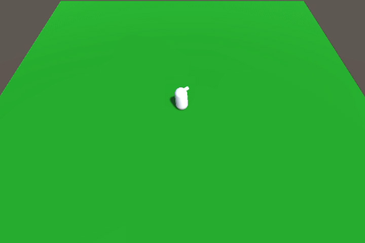
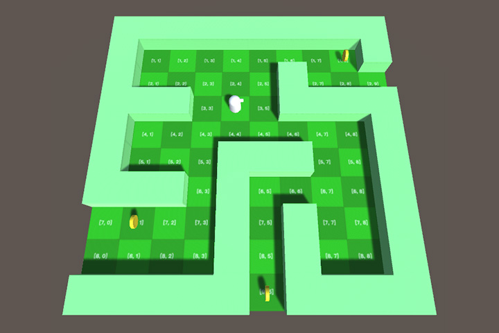

# Unity 遊戲教學目錄
匯集遊戲教學範例的目錄

 

## 3D

| 截圖 | 教學主題 |
| --- | --- |
| | <b>基本角色移動</b> https://github.com/Chenyanlintw/UnityGridGameDemo  `方向鍵控制` `CharacterController` | 
| | <b>格狀遊戲系統</b> https://github.com/Chenyanlintw/UnityGridGameDemo  `二維陣列` `繼承` `方向鍵控制` | 

